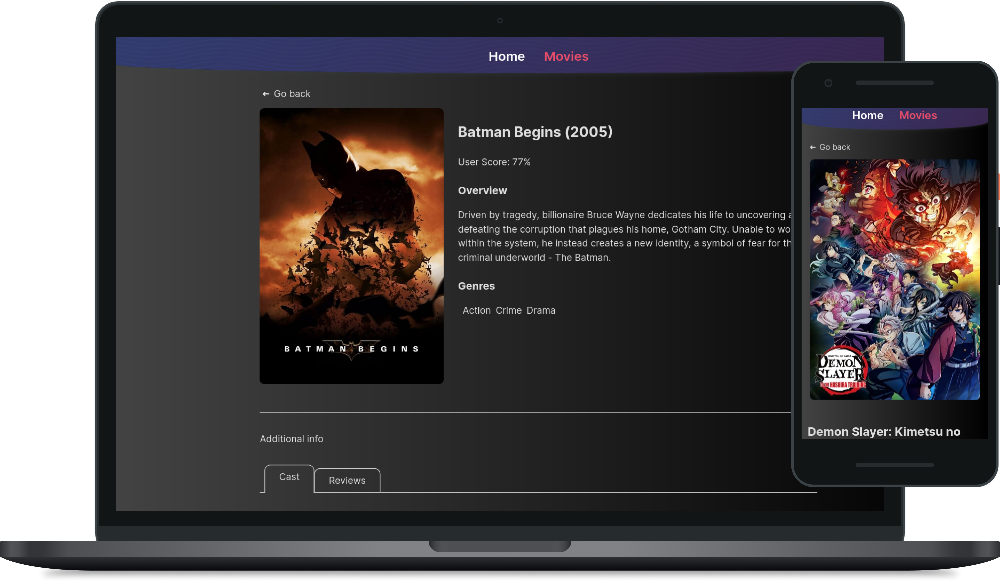

<h1 align="left">Movie Search</h1>

  

<h2 align="center">An application to find information about your favorite movies.</h2>

Application uses external [TMDB API](themoviedb.org).

To see a preview of the initial idea, use [this link](https://drive.google.com/file/d/1vR0hi3n1236Q5Bg4-se-8JVKD9UKSfId/view?usp=sharing). This implementation was based on that example.

## themoviedb.org API

The [themoviedb.org API](https://www.themoviedb.org/) was used for the backend. API requires the use of API key so you need to register and get API key (you can enter any data during registration process).

The following endpoints were used in this work:
* [/trending/get-trending](https://developers.themoviedb.org/3/trending/get-trending) to request a list of the most popular movies for today to create a collection on the home page.
* [/search/search-movies](https://developers.themoviedb.org/3/search/search-movies) to search a movie by keyword on the movie page.
* [/movies/get-movie-details](https://developers.themoviedb.org/3/movies/get-movie-details) to request full movie information for the movie page.
* [/movies/get-movie-credits](https://developers.themoviedb.org/3/movies/get-movie-credits) to request cast information for the movie page.
* [/movies/get-movie-reviews](https://developers.themoviedb.org/3/movies/get-movie-reviews) to request reviews for the movie page.

[Link to the API documentation](https://developers.themoviedb.org/3/getting-started/introduction).

## Routes

The app has the following routes: 
* `'/'` - home page with a list of popular movies. Component `HomePage`. 
* `/movies` - page with movie search by keyword. Component `MoviesPage`.
* `/movies/:movieId` - page with detailed information about the movie. Component `MovieDetailsPage`.
* `/movies/:movieId/cast` - information about the cast. Component `Cast`. Rendered on the page `MovieDetailsPage`.
* `/movies/:movieId/reviews` - information about reviews. Component `Reviews`. Rendered on the page `MovieDetailsPage`.
* If a user has accessed a non-existent route, it must be redirected to the home page.

## Code Splitting

The asynchronous JS code loading for the application routes was added using `React.lazy()` and `<Suspense>`.

## Live page

The live page for this repository can be viewed at [GitHub Pages](https://oleksandr-romashko.github.io/goit-react-hw-05-movies/).

## Local build and run

  1. Make sure you have an LTS version of Node.js installed on your computer. [Download and install](https://nodejs.org/en/) if needed.
  1. Install the project's base dependencies with the `npm install` command.
  1. Create `.env.local` file in the project root and add following environment variables (follows provided [.env.example](./.env.example) file as a helping guide): 
     1. (required) Add [TMDB API key](themoviedb.org) to `REACT_APP_TMDB_API_KEY` variable
     1. (optional) Change `REACT_APP_ROUTING_BASENAME` variable (location within your application, when your application is served from a sub-directory on the server) when deploying to GitHub to match your case.
     1. (optional) Change `REACT_APP_FUNC_SHOW_LESS` variable. Change is to `true` for "show more / show less" folding functionality for unlimited folds/unfoldes or to `false` for "show more" functionality only when all respective elements may be unfolded once and after that button disappear.
  1. Start web server by running the `npm start` command.
  1. Go to [localhost:3000](http://localhost:3000/) (port may vary) in your browser. This page will automatically reload after saving changes to the project files.

## Valuable information for the successful deploy

  1. In repository settings: GitHub Actions should have Read and write permissions as well as checked Allow GitHub Actions to create and approve pull requests in Workflow permissions. Pages should deployed from `gh-pages` branch.
  1. All deploy rules are described in [deploy.yml](.github/workflows/deploy.yml) file.
  1. For correct operation of deployed app change `homepage` value in [package.json](./package.json) (should match your repo GitHub URL, e.g. `https://<profile-name>.github.io/<repository-name>/`)
  1. All environmental variables and secrets should be set inside your repository **Settings** > **Secrets and variables** > **Actions** section:
     1. `REACT_APP_TMDB_API_KEY` should be set as a [repository secret](https://docs.github.com/en/actions/security-guides/using-secrets-in-github-actions) and should match obtained [TMDB API key](themoviedb.org) API key.
     1. `REACT_APP_ROUTING_BASENAME` should be set as a [repository variable](https://docs.github.com/en/actions/learn-github-actions/variables) and match your repository name (as your application will be served from a sub-directory on the server that matches your repository name) or other depending on your deploy conditions.
     1. `REACT_APP_FUNC_SHOW_LESS` should be set as [repository variable](https://docs.github.com/en/actions/learn-github-actions/variables). Change is to `true` for "show more / show less" folding functionality for unlimited folds/unfoldes or to `false` for "show more" functionality only when all respective elements may be unfolded once and after that button disappear.

## Task Acceptance Criteria

[React project template](https://github.com/goitacademy/react-homework-template/blob/main/README.en.md) is used as a starting point for the application.

* The `goit-react-hw-05-movies` repository is created.
* When submitting homework, there are two links: to the source files and the live page using `GitHub Pages`.
* The component state stores the minimum required set of data, the rest is calculated.
* There are no errors or warnings in the console when running application code.
* Each component has a separate folder with the React-component file and styles file.
* The `propTypes` are described for all components.
* Everything that a component expects in the form of a prop is passed to it when it is called.
* Component names are clear and descriptive.
* JS-code is clean and clear, `Prettier` is used
* Styling is done by using CSS modules or Styled Components.
